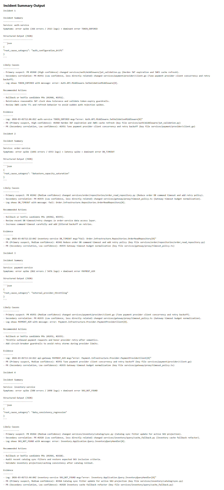
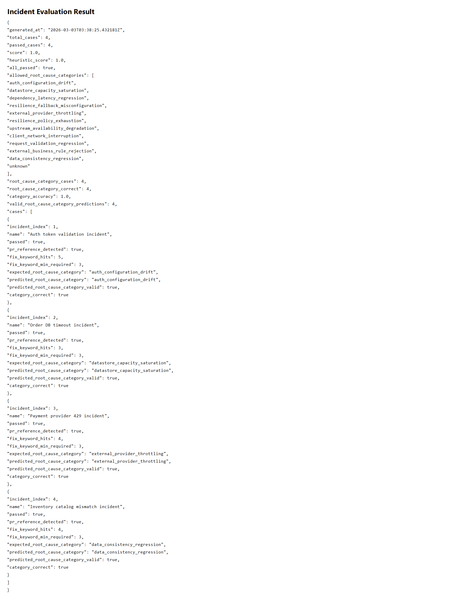

# prod-incident-ai
Production incident analysis workflow for:
- ADX-style log generation
- rule-based incident detection
- LLM-based incident brief generation
- mock PR correlation with confidence ranking and taxonomy-based evaluation

All incidents and logs in this repository are simulated for development and evaluation.

## What This Project Does
This repo simulates a production incident pipeline end-to-end:
1. Generate realistic ADX-style logs with mixed normal and error traffic.
2. Detect incident windows from error spikes.
3. Build an incident report (top errors, first-seen times, impacted services, likely area, root-cause category).
4. Ask an LLM to write an on-call incident summary with structured taxonomy output.
5. Correlate with mock GitHub PR changes using relevance ranking and confidence labels.
6. Evaluate output quality with both heuristic checks and taxonomy category accuracy.

## Sample Screenshots

Incident summary output (updated handoff format):



Evaluation report output:



## Repository Layout

```text
.
+-- configs
|   +-- config.yaml
|   +-- config.eval.yaml
+-- data
|   +-- scenarios
|   |   +-- default_scenarios.json
|   +-- mock
|   |   +-- github_recent_prs.json
|   |   +-- pr_code_changes/
|   +-- eval
|   |   +-- incident_eval_cases.json
|   +-- generated/
+-- docs
|   +-- screenshots/
+-- scripts
    +-- generate_logs.py
    +-- analyze_adx.py
    +-- summarize_incident.py
    +-- eval_incident_summary.py
    +-- run_pipeline.py
+-- src
    +-- prod_incident_ai
        +-- generate_logs.py
        +-- analyze_adx.py
        +-- summarize_incident.py
        +-- eval_incident_summary.py
        +-- run_pipeline.py
        +-- config_loader.py
```

## Quick Start
1. Set API key in `.env`.
2. Run the full pipeline:

```powershell
py scripts/run_pipeline.py
```

Generated outputs:
- `data/generated/adx_logs.jsonl`
- `data/generated/incident_report.json`
- `data/generated/incident_report.txt`
- `data/generated/incident_summary.md`

## Prerequisites
- Python 3.10+ (tested with Python 3.14)
- OpenAI API key (optional, local fallback summary is supported)

## Environment
Copy `.env.example` to `.env` in repo root:

```env
OPENAI_API_KEY=your_openai_api_key_here
OPENAI_MODEL=gpt-4o-mini
OPENAI_BASE_URL=https://api.openai.com/v1
```

## Core Scripts
### 1) Log Generator
Generate ADX-style logs with mixed normal/error production-like traffic:

```powershell
py scripts/generate_logs.py
```

Useful options:
- `--seed 42`
- `--duration-minutes 180`
- `--baseline-rps 6`
- `--incident-error-ratio 0.35`

### 2) Incident Analyzer
Create structured incident report from ADX logs:

```powershell
py scripts/analyze_adx.py
```

Outputs:
- `data/generated/incident_report.json`
- `data/generated/incident_report.txt`

### 3) Summary Generator (LLM)
Generate markdown incident brief:

```powershell
py scripts/summarize_incident.py --allow-fallback
```

Summary output:
- `data/generated/incident_summary.md`

Notes:
- If `OPENAI_API_KEY` is set, OpenAI is used.
- If OpenAI fails and `--allow-fallback` is set, a local template summary is produced.
- The prompt includes compact nearby log snippets, not full raw logs.
- Each incident includes structured JSON:
  - `{"root_cause_category": "<lowercase_taxonomy_value>"}`
- PR correlations in `Likely Causes` include:
  - `Primary suspect` and `Secondary correlation` labels
  - confidence level (`High`/`Medium`/`Low`)

### 4) One-Command Pipeline
Run generate -> analyze -> summarize:

```powershell
py scripts/run_pipeline.py
```

Useful options:
- `--config configs/config.yaml`
- `--strict-llm`
- `--skip-generate`
- `--skip-analyze`
- `--skip-summarize`

## Scenario Configuration
Incident simulation is controlled by:
- `data/scenarios/default_scenarios.json`

Each scenario defines:
- incident timing (`start_offset_min`, `duration_min`)
- impacted services
- weighted error signatures (`error_catalog`)

## GitHub Mock Integration
Summary generation can include mock PR context.

Config file:
- `configs/config.yaml`

```yaml
github:
  enabled: false
  mock_endpoint: data/mock/github_recent_prs.json
  timeout_seconds: 10
  max_pull_requests: 5
```

Behavior:
- `enabled: false` -> no GitHub endpoint/file access.
- `enabled: true` -> load PR context from `mock_endpoint` and use in summary.

Mock data:
- `data/mock/github_recent_prs.json`
- `data/mock/pr_code_changes/*.patch`

## Evaluation Workflow
Run with eval config (GitHub mock enabled):

```powershell
py scripts/run_pipeline.py --config configs/config.eval.yaml
py scripts/eval_incident_summary.py
```

Eval outputs:
- `data/generated/incident_eval_result.json`
  - includes heuristic `score` and taxonomy `category_accuracy`
  - includes predicted vs expected `root_cause_category` per incident

Eval spec:
- `data/eval/incident_eval_cases.json`
  - each case can define `expected_root_cause_category`

Root-cause taxonomy:
- Summaries are expected to include a structured JSON field per incident:
  - `{"root_cause_category": "..."}` using predefined lowercase taxonomy categories.
